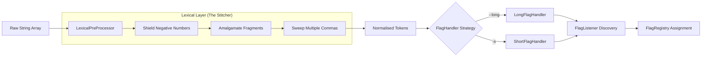

# CLI Command Parsing

A lightweight high-performance Java command-line parser employing a strategy-based design pattern to transform unpredictable, fragmented shell input into a validated, structured application state. The core strength of the parser logic lies in a smart **Lexical pre-processing** layer that ensures raw data is accurately tokenised, amalgamated, and validated prior to execution.

## 🚀 Key Features

* **Java 8 Baseline:** Programmed for **Java 8 and higher**.
* **Lexical Amalgamation:** Automatically "stitches" fragmented shell inputs (e.g., `["--temp", "=", "20"]` becomes `"--temp=20"`).
* **Strict Validation Suite:** Automatically enforces mandatory flags, operand limits, and separator requirements, for example: `ARG_BLANK` vs `SEP_REQUIRED`.
* **Error Aggregation:** Instead of failing on the first error, the parser collects all issues into a single `ParseException`, providing a comprehensive report.
* **The "Negative Number Shield":** Smart regex logic that distinguishes between command flags and numeric data/ranges.

## 🛠 Architectural Overview

The engine processes input through a three-phase pipeline: **Definition**, **Tokenisation**, and **Execution**.



## 📚 API Documentation

**Detailed Javadoc is available online:** 👉 **[ https://trevormaggs.github.io/CLI-Command-Parsing/]( https://trevormaggs.github.io/CLI-Command-Parsing/)**

---

## ⚙️ Setting Up CommandFlagParser

To begin parsing, you must define the "rules of engagement" for your flags using the `FlagType` constraints. 

<b>Important:</b> you must specify a short dash ('-') and a long dash ('--') to follow the standard POSIX and GNU conventions respectively.

```java
// 1. Initialise with raw arguments
CommandFlagParser cli = new CommandFlagParser(args);

try {
    // 2. Define flags and their expected behaviour
    cli.addDefinition("-v", FlagType.ARG_BLANK);          
    cli.addDefinition("-f", FlagType.ARG_REQUIRED);       
    cli.addDefinition("--range", FlagType.SEP_OPTIONAL); 
    
    // 3. Set global constraints
    cli.setFreeArgumentLimit(2); 
    
    // 4. Execute the parse
    cli.parse();
    
} catch (ParseException e) {
    System.err.println("Configuration Error:\n" + e.getMessage());
}

```

### Flag Configuration Constraints (`FlagType`)

| FlagType | Behaviour | Example |
| --- | --- | --- |
| `ARG_REQUIRED` | Mandatory value, typically following a space. | `-f value` |
| `ARG_OPTIONAL` | Optional value is permitted. | `-f [value]` |
| `SEP_REQUIRED` | Mandatory value **must** use an equals separator. | `--file=data.txt` |
| `SEP_OPTIONAL` | Optional value permitted via an equals separator. | `--file[=data.txt]` |
| `ARG_BLANK` | A boolean "switch" flag with no associated value. | `--verbose` |

---

## 📥 Value Retrieval API

The `CommandFlagParser` acts as a data access layer for safe querying of the parsed state.

### 1. Checking Presence

```java
if (cli.existsFlag("-v")) {
    System.out.println("Verbose mode enabled.");
}

```

### 2. Retrieving Single & Multi-Values

```java
// Get a primary value
String config = cli.getValueByFlag("-f");

// Iterate through multi-values (e.g., --platform=win10,rhel)
int count = cli.getValueLength("platform");
for (int i = 0; i < count; i++) {
    System.out.println("Target OS: " + cli.getValueByFlag("platform", i));
}

```

### 3. Accessing Free-Standing Arguments (Operands)

```java
// Example: myapp.jar --verbose input.txt output.txt
int total = cli.getFreeArgumentCount(); // Returns 2
String source = cli.getFirstFreeArgument(); // Returns "input.txt"
String target = cli.getFreeArgumentByIndex(1); // Returns "output.txt"
```

---

## 🔧 Technical Specification: Input Handling

| Format | Example | Description |
| --- | --- | --- |
| **Clustered** | `-vh` | Expanded into individual discoveries for `v` and `h`. |
| **Attached** | `-p8080` | Extracts `8080` as the argument for flag `p`. |
| **Explicit (Eq)** | `--mode=fast` | Extracts `fast` via the `=` separator. |
| **Comma-Delimited** | `--list=a,b,c` | **Supported:** Merges comma-delimited values into a collection. |
| **Numeric Ranges** | `--temp -5, -2` | **Shielded:** Recognition of negative ranges as data. |

---

## 🧪 Expected Output (Test Cases)

Below are examples of how the `LexicalPreProcessor` transforms varied inputs into cohesive, logical tokens.

| Raw Shell Input | Flattened Token Result | Logic Applied |
| --- | --- | --- |
| `--platform=win10` `,` `rhel` | `[--platform=win10,rhel]` | **Comma-Stitching:** Merges fragments. |
| `--temp` `-5.7, -0.5` | `[--temp-5.7,-0.5]` | **Numeric Shield:** Protects negative data. |
| `--range=` `, ,` `100` | `[--range=100]` | **Comma-Sweeping:** Removes noise. |

---

## 🏗 Getting Started

Clone the repository:

```bash
git clone https://github.com/trevormaggs/Command-Line-Parser.git
```
Requirements:

* **Minimum Java Version:** Java 8 and higher.
* **Dependencies:** None.
* Import directly into your IDE to start using

Review the **[Javadoc documentation]( https://trevormaggs.github.io/CLI-Command-Parsing/)** for detailed API usage.

---

## ✍️ Credits

This library is developed and maintained by **Trevor Maggs**.

Anyone wishing to use this resource is welcome to download or clone the repository via Git. If you have any comments, suggestions, or find any bugs, please direct your questions to me via email: **[trevmaggs@tpg.com.au](mailto:trevmaggs@tpg.com.au)**.

---


